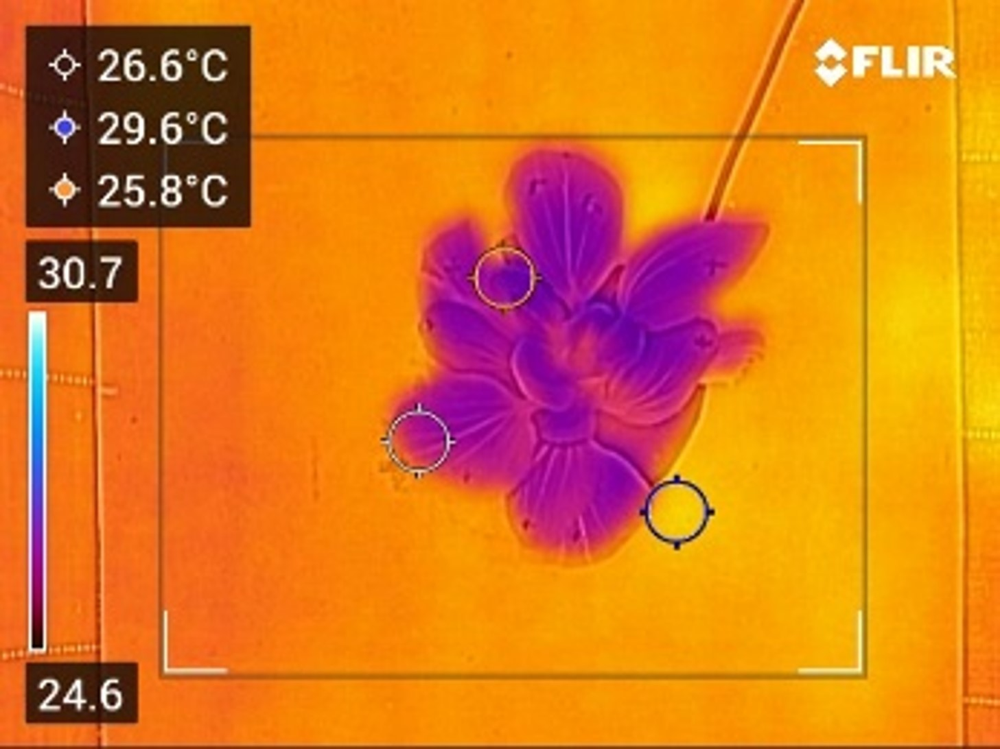
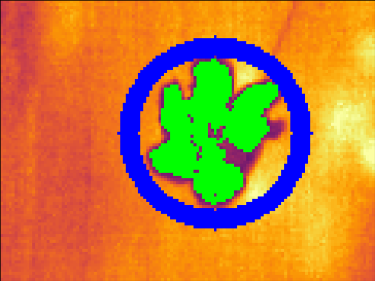
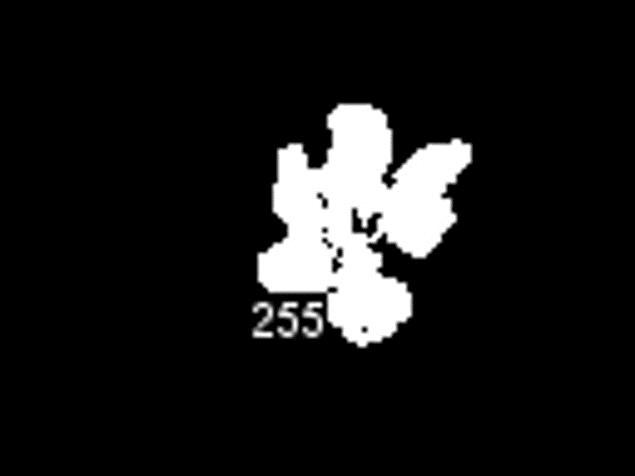
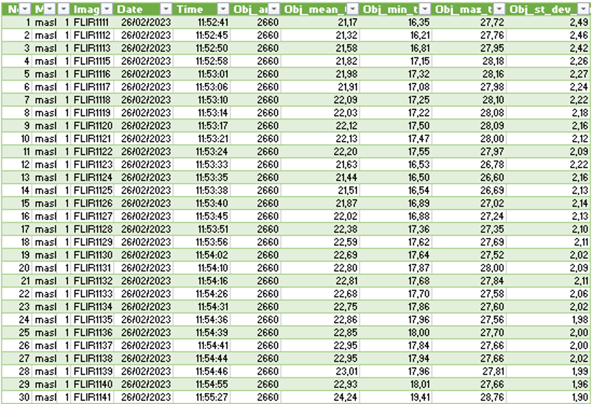
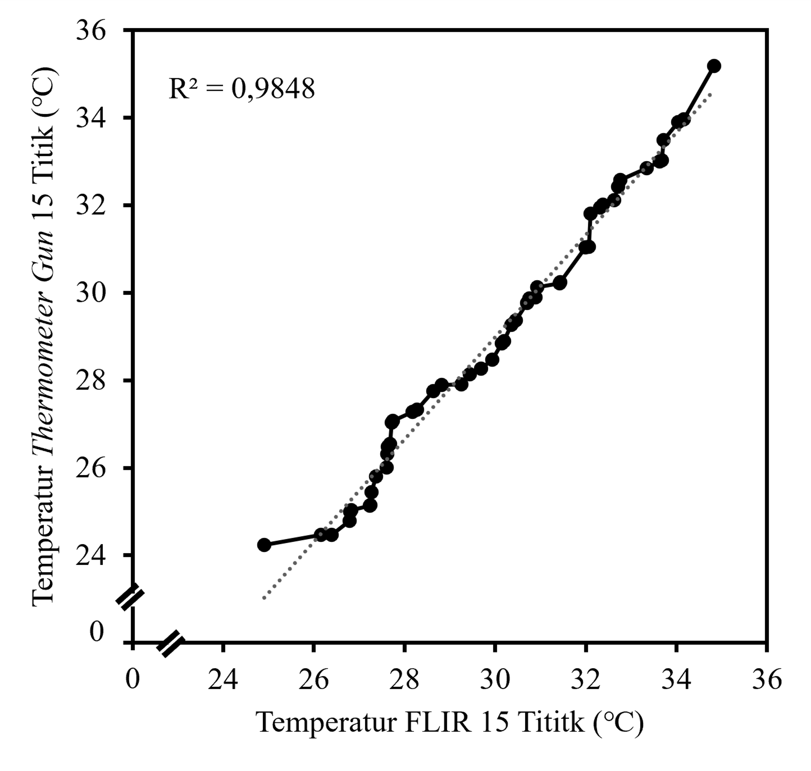
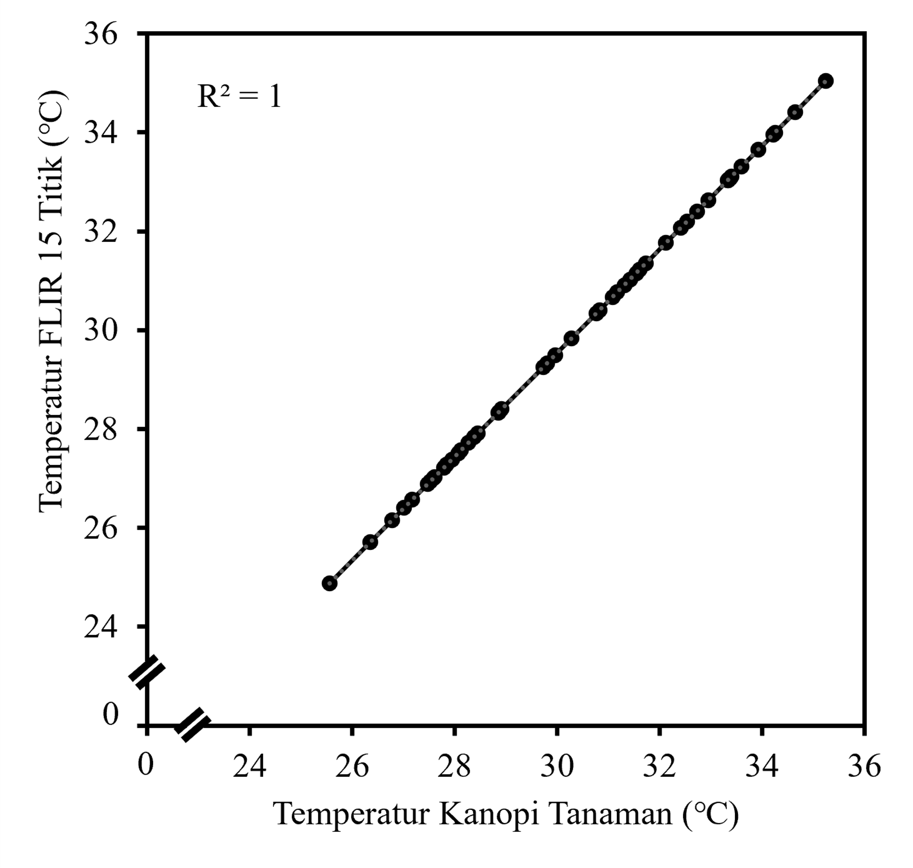
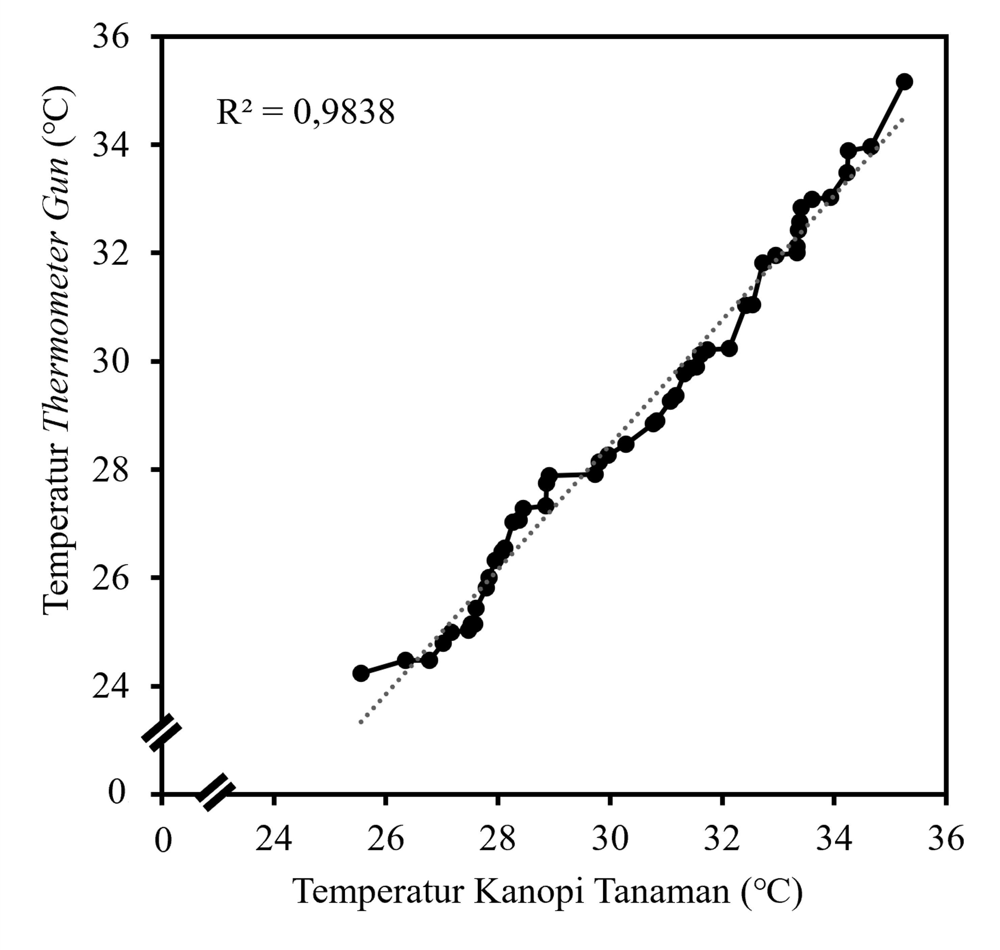

## 
Plant Canopy Temperature

    
  

This project was used in my undergraduate thesis <a href="https://etd.repository.ugm.ac.id/penelitian/detail/226056">"Performance Analysis of FLIR Thermal Camera in Plant Canopy Temperature Monitoring System and Its Sensitivity to Greenhouse Environment"</a>. Thermal camera used in monitoring bok choy (Brassica rapa subsp. chinensis) canopy temperature was FLIR CX-3. Greenhouse (PT Adidaya Pertanian dan Pangan Indonesia or Agrarise) was located in Yogyakarta, Indonesia. This research was done with the help of Smart Agriculture Research Group.

**How to Acquire Plant Canopy Temperature:**
 
1. Install ImageJ
2. Install IRimage (see below to see installation detail)
3. Open ImageJ
4. Extract thermal data using IRimage plugins on "1-Process" menu
5. Open colab 
6. Change source file path
7. Acquire thermal data on "2-Measure" menu using plant mask from no. 5

 

## 
Results

Thermal data in plant canopy images taken from FLIR CX-3 was able to be extracted. Image segmentation method was binary threshold. Plant canopy temperature acquired from masking was able to represent actual plant canopy temperature.

|                 Thermal Image                       |        Image Segmentation                                 | Mask                                        |
|-----------------------------------------------------|-----------------------------------------------------------|---------------------------------------------|
|| | |

### Example of plant canopy temperature in table

### Plant canopy temperature reading validation
| Thermometer gun and FLIR Thermal camera             | FLIR Thermal camera and Mask                              | Mask and thermometer gun                    |
|-----------------------------------------------------|-----------------------------------------------------------|---------------------------------------------|
|| | |

  
Table Notes

    * Thermometer gun and FLIR thermal camera reading based on 15 point scatter across plant canopy from the same spot

## 
About ``IRimage``  -Open source software for processing images from infrared thermal cameras- 

### Summary

``IRimage`` aims at increasing throughput, accuracy and reproducibility of results obtained from thermal images, especially those produced with affordable, consumer-oriented cameras. IRimage processes thermal images, extracting raw data and calculating temperature values with an open and fully documented algorithm, making this data available for further processing using image analysis software. It also allows to make reproducible measurements of the temperature of objects in series of images, and produce visual outputs (images and videos) suitable for scientific reporting. IRimage is implemented in a scripting language of the scientific image analysis software ImageJ, allowing its use through a graphical user interface and also allowing for an easy modification or expansion of its functionality. IRimage’s results were consistent with those of standard software for 15 camera models of the most widely used brand. IRimage's functionalities make it better suited for research purposes than many currently available alternatives, and could contribute to making affordable consumer-grade thermal cameras useful for reproducible research.

``IRimage`` is open source, in order to allow users to know the algorithms used to obtain the temperature values, as well as to encourage future improvement, modification and adaptation.

``IRimage-UAV`` is an alternative version of IRimage which is able to process images from thermal cameras used in DJI drones. It is especially useful for batch converting JPG images to TIFF format, retaining GPS location data, which is useful for further processing using photogrammetry software. For technical reasons, ``IRimage-UAV`` does not use the same algorithm as ``IRimage``, but uses the DJI Thermal SDK for image processing and conversion.

``IRimage`` works in Windows and MacOs. ``IRimage-UAV`` only works in Windows.

---

### Installation

1. Install [ImageJ](https://imagej.nih.gov/ij/download.html) or [FIJI](https://imagej.net/Fiji/Downloads) (take note of the location where it is installed - you will need it in step 4).
2. In MacOS, you will need to also install [Exiftool](https://exiftool.org/) (download and install the "MacOS package" version). In Windows the installation is not required, since this tool is included with IRimage.
3. Download the complete [IRimage repository](https://github.com/gpereyrairujo/IRimage) using the 'Download ZIP' option in the green 'Code' button, save the ``IRimage-main.zip`` file and extract its contents.
3. Open the recently un-zipped ``IRimage-main`` folder, then open the sub-folder corresponding to your operating system (``Windows`` or ``MacOS``), and then copy the complete ``IRimage`` (or ``IRimage-UAV``) folder to the ``ImageJ.app/plugins`` folder (or the ``Fiji.app/plugins`` folder if you installed FIJI). The dowloaded .zip file and the extracted ``IRimage-main`` folder can then be deleted.

### Basic usage

1. Open ImageJ (or FIJI)
2. Open the 'Plugins' menu and you will find the 'IRimage' submenu
3. Select the 'Process' option
4. Select the folder with the original JPG images from the thermal camera
5. Choose whether you want to use the parameters stored in each file (when these were set in the camera), manually set global parameters for all the images, or use previously defined parameters (e.g. to repeat a previous analysis)
6. If the second option was selected, modify the default parameter values and click OK
7. The resulting images and data will be stored in subfolders within the input folder

More details about IRimage's implementation, functions and usage are included in the [IRimage paper](https://doi.org/10.7717/peerj-cs.977). Data and code for IRimage's validation and the example use case included in the paper are available at https://github.com/gpereyrairujo/IRimage_paper.

### Supported cameras

These are the camera models that have been tested (other models might also work)

With IRimage:
- FLIR B360
- Flir B60
- FLIR C2
- FLIR E30bx
- FLIR E40
- FLIR E40bx
- FLIR E60
- FLIR E60bx
- FLIR E85
- FLIR i60
- FLIR i7
- FLIR One
- FLIR One Pro
- FLIR P640
- FLIR T420
- FLIR T440
- FLIR Vue Pro R
- InfraCAM Wester
- ThermaCAM EX320
- ThermaCAM SC640
- ThermaCAM SC640

With IRimage-UAV: 
- DJI Matrice 30 T
- DJI Mavic 2 Enterprise Advanced
- DJI Mavic 3T
- DJI Zenmuse H20N
- DJI Zenmuse H20T
- DJI Zenmuse XT S

### License

IRimage and IRimage-UAV Software licensed [GNU Affero General Public License v3.0](https://github.com/gpereyrairujo/IRimage/blob/main/LICENSE)   
Documentation and images licensed [CC-BY-SA-4.0](https://creativecommons.org/licenses/by-sa/4.0/)   
ExifTool is Copyright 2003-2021, Phil Harvey, licensed under [GNU General Public License](https://dev.perl.org/licenses/gpl1.html)   
DJI Thermal SDK is Copyright 2020-2023 DJI, licensed under [MIT License](https://opensource.org/license/mit/)

## 
Reference

- Pereyra Irujo G. 2022. IRimage: open source software for processing images from infrared thermal cameras. PeerJ Computer Science 8:e977 https://doi.org/10.7717/peerj-cs.977
- Gehan MA*, Fahlgren N*, Abbasi A, Berry JC, Callen ST, Chavez L, Doust AN, Feldman MJ, Gilbert KB, Hodge JG, Hoyer JS, Lin A, Liu S, Lizárraga C, Lorence A, Miller M, Platon E, Tessman M, Sax T. 2017. PlantCV v2: Image analysis software for high-throughput plant phenotyping. PeerJ 5:e4088. DOI: 10.7717/peerj.4088
